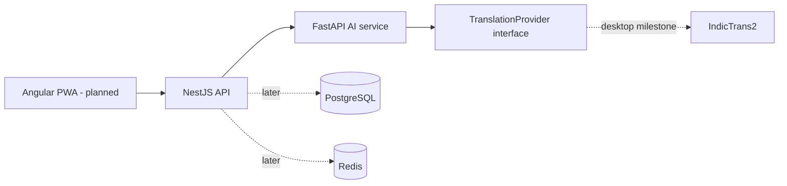

# BharatVoice

**An Odia-first multilingual communication platform.** BharatVoice is being built to help people translate, speak, listen, and communicate across Odia, Hindi, and English—with Odia treated as a first-class language.

> **Project status:** early development. The original standalone HTML prototype and the first API foundation are in this repository. Neural translation models and the Angular application are not integrated yet; the translation API deliberately reports “not ready” instead of returning made-up translations.

## Contents

- [Product scope](#product-scope)
- [Current status](#current-status)
- [Architecture](#architecture)
- [Repository structure](#repository-structure)
- [Laptop setup](#laptop-setup)
- [Run the services](#run-the-services)
- [API overview](#api-overview)
- [Tests and quality checks](#tests-and-quality-checks)
- [Desktop AI handoff](#desktop-ai-handoff)
- [Deployment and security](#deployment-and-security)
- [Project documents](#project-documents)
- [Contribution workflow](#contribution-workflow)

## Product scope

### Phase 1

| Capability | Phase 1 scope | Current state |
| --- | --- | --- |
| Text translation | English ↔ Odia and English ↔ Hindi | API contract and gateway are implemented; IndicTrans2 is not connected yet |
| Language identification | English, Odia, Hindi | Planned |
| Speech to text | English, Odia, Hindi | Planned; IndicConformer is the intended provider |
| Text to speech | Supported Phase 1 languages | Planned; AI4Bharat Indic-TTS is the initial candidate |
| Speech translation | Speech → text → translation → speech | Planned after the individual providers work |
| Transliteration | Roman/native-script conversion, beta | Planned; IndicXlit is the initial candidate |
| Translation history | View, copy, replay, delete | Prototype behavior only; persistence is not implemented |
| Turn-based conversation | Two speakers, two languages | Prototype behavior only; real translation is not implemented |

**Odia ↔ Hindi direct translation is excluded from Phase 1.** It is reserved for Phase 2. The API validates the four permitted Phase 1 directions and rejects unsupported pairs.

### Prototype versus product

[BharatVoice prototype.html](BharatVoice%20prototype.html) is a visual/interaction reference. Its phrase samples, small transliteration lookup, and browser speech features are demonstration behavior—not an AI translation engine or production speech stack. Do not use prototype output as a translation-quality benchmark.

## Current status

- **FastAPI AI service:** health/readiness endpoints, validated Phase 1 translation schema, provider protocol, and an unconfigured IndicTrans2 provider boundary.
- **NestJS API:** local gateway, request validation, translation forwarding, and health endpoint.
- **Translation models:** not downloaded or connected. Until the desktop inference milestone, valid translation calls return HTTP 503 with `translation_provider_not_ready`.
- **Frontend:** original HTML prototype only; Angular PWA migration is tracked in [TASKS.md](TASKS.md).
- **Persistence, accounts, speech models, Docker deployment, and public pilot:** not implemented.

This separation keeps the laptop useful for application and contract work without pretending that its CPU is the planned AI benchmark environment.

## Architecture



### Service responsibilities

- **Angular PWA (planned):** user interface, browser audio capture/playback, and installable app experience.
- **NestJS:** application-facing REST API, validation, authentication, business rules, and eventually history/rate limiting.
- **FastAPI:** AI request contracts, orchestration, model lifecycle, and inference providers.
- **IndicTrans2:** authoritative translation provider. Gemma may later normalize or route validated input; it must not silently replace IndicTrans2 as the translator.
- **Later providers:** IndicConformer (ASR), AI4Bharat Indic-TTS (speech synthesis), and IndicXlit (transliteration).
- **Later infrastructure:** PostgreSQL, Redis, object storage, Docker Compose, metrics/monitoring, and optional private pilot ingress.

## Repository structure

```text
apps/
	api-nestjs/          NestJS application gateway
services/
	ai-fastapi/          FastAPI AI service and provider boundaries
docs/
	api-contracts.md     Version 0.1 API behavior
	architecture.md      Architecture and implementation constraints
BharatVoice prototype.html
											Original UI prototype/reference
```

The Angular app, shared-contract package, and deployment stack will be added when their initial implementation starts. Model weights, caches, generated output, Python environments, and Node dependencies are intentionally excluded from Git.

## Laptop setup

The laptop is the application/UI development and API-testing machine. The deployment plan describes it as a 10th-generation i5 with 12 GB RAM and no useful CUDA GPU. Keep model-heavy work for the desktop; do not interpret laptop CPU timings as the target inference performance.

### Requirements

- Windows 10/11 with PowerShell
- Python 3.12
- Node.js 20 or newer and npm (the checked laptop currently has Node.js 24)
- Git
- Optional for later container work: Docker Desktop with Docker Compose enabled

The checked laptop has Python 3.12.10, npm 11.11.1, Docker CLI 29.3.1, and Docker Compose v5.1.1. Docker CLI presence does not by itself mean Docker Desktop/the daemon is running.

### Install dependencies

Run these commands from the repository root. The Python environment and Node dependencies stay local and are ignored by Git.

```powershell
py -3.12 -m venv .venv
.\.venv\Scripts\python.exe -m pip install -r services/ai-fastapi/requirements.txt
npm ci
```

Optional local settings are documented in [.env.example](.env.example). NestJS loads the root `.env` when present. Never put real credentials, tokens, private audio, or model weights in committed files.

## Run the services

Start the AI API in **PowerShell terminal 1**:

```powershell
.\.venv\Scripts\python.exe -m uvicorn app.main:app --app-dir services/ai-fastapi --host 127.0.0.1 --port 8000
```

Start the NestJS gateway in **PowerShell terminal 2**:

```powershell
npm run api:dev
```

Both services bind to loopback by default; they are intended for local development, not direct network/public access.

| Service | Local address | Purpose |
| --- | --- | --- |
| NestJS gateway | `http://127.0.0.1:3000` | Browser/application-facing API |
| FastAPI AI service | `http://127.0.0.1:8000` | Private inference API |
| NestJS health | `GET /api/v1/health` | Gateway liveness |
| FastAPI health | `GET /health` | AI process liveness (not model readiness) |
| FastAPI readiness | `GET /ready` | Provider readiness; returns 503 until a model is configured |

## API overview

### Translate

`POST http://127.0.0.1:3000/api/v1/translation`

Request body:

```json
{
	"text": "Hello",
	"source_language": "en",
	"target_language": "or"
}
```

Language codes: `en` (English), `or` (Odia), and `hi` (Hindi). Only `en → or`, `or → en`, `en → hi`, and `hi → en` are accepted. Input must contain 1–5,000 characters. Blank text, unknown request fields, same-language pairs, and Odia ↔ Hindi pairs are rejected.

Until a real IndicTrans2 provider is installed, a valid translation request returns HTTP 503 with a structured `translation_provider_not_ready` error. This is expected and prevents prototype phrases or an LLM from being misrepresented as neural translation.

See [docs/api-contracts.md](docs/api-contracts.md) for the response schema and health/readiness details.

## Tests and quality checks

Run from the repository root:

```powershell
npm run api:build
npm run api:test
.\.venv\Scripts\python.exe -m pytest services/ai-fastapi
npm audit
```

The initial test suite covers the FastAPI health endpoint, Phase 1 pair validation, blank input rejection, the explicit missing-model response, and NestJS gateway behavior. Tests do not download model weights or test translation quality.

## Desktop AI handoff

The desktop is the planned model-development/inference host: Intel i5-11400, 16 GB RAM, and GTX 1650 Super with 4 GB VRAM. Its OS, NVIDIA driver, runtime configuration, free disk, and actual GPU status still need to be checked on that machine.

Recommended order:

1. Pull the committed laptop branch on the desktop and read [DESKTOP.md](DESKTOP.md), [TASKS.md](TASKS.md), and the technical/deployment documents.
2. Record desktop OS, driver/runtime compatibility, free storage, RAM, and GPU/VRAM availability before installing model dependencies.
3. Implement the English → Odia IndicTrans2 distilled 200M baseline first; measure cold/warm latency, RAM/VRAM, and quality.
4. Add Odia → English, then English ↔ Hindi with the corresponding direction-specific checkpoints.
5. Record checkpoint version, license, latency, and evaluation results. Keep weights outside Git.
6. Add Gemma only after the direct IndicTrans2 baseline, and only for allow-listed normalization/routing.
7. Add ASR, TTS, and transliteration incrementally. Do not try to keep every model resident in 4 GB VRAM; isolate model lifecycle and unload models as needed.

## Deployment and security

The laptop workflow is private/local. The deployment guide recommends the desktop as the initial AI host and Ubuntu Server 24.04 LTS as the preferred long-term host OS; Windows is supported for development. The full Docker Compose deployment is future work and is not currently included.

For a later family/private pilot, the supplied deployment plan recommends an outbound Cloudflare Tunnel rather than router port-forwarding. Before exposing anything, the project still needs authentication, HTTPS, rate limiting, monitoring/log rotation, database backups and restore tests, and an explicit audio-retention policy. Never expose PostgreSQL, Redis, or inference services directly to the Internet. A home desktop is not a highly available production server.

Model and dataset licenses must be tracked separately. Check the specific checkpoint terms before redistribution or deployment; Gemma has its own terms and is not covered by the IndicTrans2 MIT license.

## Project documents

- [Phase 1 PRD](BharatVoice_PRD_Phase_1.docx) — scope, acceptance criteria, non-functional requirements, and Phase 2 boundary.
- [Codex & AI technical documentation](BharatVoice_Codex_AI_Technical_Documentation.docx) — model/provider contracts, repositories, testing strategy, and implementation order.
- [Server & deployment documentation](BharatVoice_Server_Deployment_Documentation.docx) — laptop/desktop roles, local topology, GPU constraints, and private-pilot guidance.
- [Architecture notes](docs/architecture.md) and [API contract](docs/api-contracts.md) — current implementation decisions.
- [Task tracker](TASKS.md), [project history](HISTORY.md), [laptop guide](LAPTOP.md), and [desktop handoff](DESKTOP.md) — project progress and machine-specific workflow.

## Contribution workflow

1. Read the PRD, technical guide, and deployment guide before changing scope or architecture.
2. Keep the Phase 1 language matrix enforced at every API boundary; do not add direct Odia ↔ Hindi translation.
3. Add/update provider and contract tests before replacing model implementations.
4. Keep model weights, virtual environments, `node_modules`, secrets, private audio, and local databases out of Git.
5. Update [TASKS.md](TASKS.md) when work changes state and [HISTORY.md](HISTORY.md) for meaningful milestones.
6. Keep laptop-specific and desktop-specific instructions in [LAPTOP.md](LAPTOP.md) and [DESKTOP.md](DESKTOP.md), respectively.

The current Git branch is `main`. The project remote is `https://github.com/sikunaniket1234/bharatvoice.git`; pull on the desktop only after the reviewed commit has been pushed.
