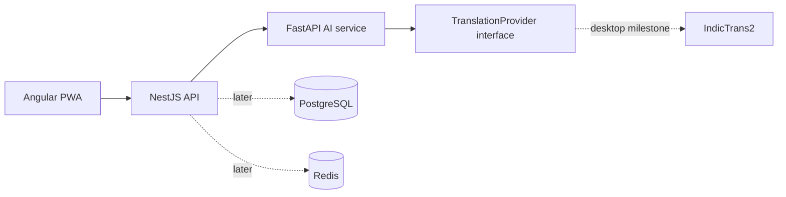

# BharatVoice

**An Odia-first multilingual communication platform.** BharatVoice is being built to help people translate, speak, listen, and communicate across Odia, Hindi, and English—with Odia treated as a first-class language.

> **Project status:** early development. The Angular PWA and three-service Docker development stack are implemented. Neural translation models are not integrated yet; the translation API deliberately reports “not ready” instead of returning made-up translations.

## Contents

- [Product scope](#product-scope)
- [Current status](#current-status)
- [Architecture](#architecture)
- [Repository structure](#repository-structure)
- [Laptop setup](#laptop-setup)
- [Run the services](#run-the-services)
- [API overview](#api-overview)
- [Tests and quality checks](#tests-and-quality-checks)
- [Desktop AI handoff](#desktop-ai-handoff)
- [Deployment and security](#deployment-and-security)
- [Project documents](#project-documents)
- [Contribution workflow](#contribution-workflow)

## Product scope

### Phase 1

| Capability | Phase 1 scope | Current state |
| --- | --- | --- |
| Text translation | English ↔ Odia and English ↔ Hindi | Angular-to-API flow is connected; IndicTrans2 is not connected yet |
| Language identification | English, Odia, Hindi | Planned |
| Speech to text | English, Odia, Hindi | Browser speech-recognition UI is present where supported; IndicConformer is not connected |
| Text to speech | Supported Phase 1 languages | Browser speech playback UI is present where supported; Indic-TTS is not connected |
| Speech translation | Speech → text → translation → speech | Planned after the individual providers work |
| Transliteration | Roman/native-script conversion, beta | Planned; IndicXlit is the initial candidate |
| Translation history | View, copy, replay, delete | Stored locally in this browser after successful model translations |
| Turn-based conversation | Two speakers, two languages | Angular UI sends turns to the API; requires desktop model for translation |

**Odia ↔ Hindi direct translation is excluded from Phase 1.** It is reserved for Phase 2. The API validates the four permitted Phase 1 directions and rejects unsupported pairs.

### Prototype versus product

[BharatVoice prototype.html](BharatVoice%20prototype.html) is a visual/interaction reference. Its phrase samples, small transliteration lookup, and browser speech features are demonstration behavior—not an AI translation engine or production speech stack. Do not use prototype output as a translation-quality benchmark.

## Current status

- **FastAPI AI service:** health/readiness endpoints, validated Phase 1 translation schema, provider protocol, and an implemented IndicTrans2 distilled-200M provider with model lifecycle management.
- **NestJS API:** local gateway, request validation, translation forwarding, and health endpoint.
- **Translation models:** the inference code path is complete but **no weights are downloaded yet**. Both IndicTrans2 checkpoints are gated on Hugging Face and return HTTP 401 without a token, so valid translation calls still return HTTP 503 `translation_provider_not_ready` with an actionable reason.
- **Frontend:** Angular PWA with translation, speech tools, local history, conversation, transliteration preview, and light/dark themes; original prototype is retained as reference.
- **Persistence/accounts, AI speech models, database, and public pilot:** not implemented. Docker Compose runs the local web, gateway, and AI API containers.

This separation keeps the laptop useful for application and contract work without pretending that its CPU is the planned AI benchmark environment.

## Architecture



### Service responsibilities

- **Angular PWA:** user interface, browser audio capture/playback where supported, installable app manifest, and cached application shell.
- **NestJS:** application-facing REST API, validation, authentication, business rules, and eventually history/rate limiting.
- **FastAPI:** AI request contracts, orchestration, model lifecycle, and inference providers.
- **IndicTrans2:** authoritative translation provider. Gemma may later normalize or route validated input; it must not silently replace IndicTrans2 as the translator.
- **Later providers:** IndicConformer (ASR), AI4Bharat Indic-TTS (speech synthesis), and IndicXlit (transliteration).
- **Later infrastructure:** PostgreSQL, Redis, object storage, Docker Compose, metrics/monitoring, and optional private pilot ingress.

## Repository structure

```text
apps/
	web-angular/         Angular PWA
	api-nestjs/          NestJS application gateway
services/
	ai-fastapi/          FastAPI AI service and providers
		app/config.py            Environment-driven model/device settings
		app/model_manager.py     Checkpoint load/unload for a small VRAM budget
		app/providers/           TranslationProvider implementations
		eval/                    Controlled bilingual evaluation set + reports
		scripts/                 Benchmark runner
docs/
	api-contracts.md     Version 0.1 API behavior
	architecture.md      Architecture and implementation constraints
BharatVoice prototype.html
											Original UI prototype/reference
```

The shared-contract package and production deployment stack will be added when their implementation starts. Model weights, caches, generated output, Python environments, and Node dependencies are intentionally excluded from Git.

## Laptop setup

The laptop is the application/UI development and API-testing machine. The deployment plan describes it as a 10th-generation i5 with 12 GB RAM and no useful CUDA GPU. Keep model-heavy work for the desktop; do not interpret laptop CPU timings as the target inference performance.

### Requirements

- Windows 10/11 with PowerShell
- Python 3.12
- Node.js 20 or newer and npm (the checked laptop currently has Node.js 24)
- Git
- Docker Desktop with Docker Compose enabled for the recommended stack

The checked laptop has Python 3.12.10, npm 11.11.1, Docker CLI 29.3.1, and Docker Compose v5.1.1. Docker CLI presence does not by itself mean Docker Desktop/the daemon is running.

### Install dependencies

Run these commands from the repository root. The Python environment and Node dependencies stay local and are ignored by Git.

```powershell
py -3.12 -m venv .venv
.\.venv\Scripts\python.exe -m pip install -r services/ai-fastapi/requirements.txt
npm ci
```

On Windows, PowerShell's default execution policy blocks `npm.ps1`. Use `npm.cmd` in place of `npm`. If `npm ci` reports packages with install scripts that are not yet approved, run `npm approve-scripts <pkg>` for `esbuild`, `@parcel/watcher`, `lmdb`, `msgpackr-extract` and `unrs-resolver`; the approved list is already recorded in `package.json`, so this is only needed on a fresh checkout with a different npm version.

### Enable AI inference (desktop only)

Inference runs in the Docker `ai` service, **not** in the Windows virtualenv. `IndicTransToolkit` provides `IndicProcessor` only as a compiled Cython extension and publishes no `win_amd64` wheel for any Python version, so it cannot be installed on Windows x86-64 without first installing the multi-gigabyte Microsoft C++ Build Tools. A `cp312` `manylinux_x86_64` wheel exists, so the container needs no compiler at all. The Windows `.venv` is deliberately kept contract-only.

The contract, health and readiness endpoints all work without a machine-learning stack, so leaving `AI_INSTALL_ML` false is a valid state.

```powershell
$env:AI_INSTALL_ML = "true"
docker compose up --build -d
```

Confirm the runtime inside the container:

```powershell
docker compose exec ai python -c "import torch; print(torch.__version__, torch.cuda.is_available())"
```

Both checkpoints are **gated on Hugging Face**. Accept the conditions on these pages with your account first:

- <https://huggingface.co/ai4bharat/indictrans2-en-indic-dist-200M>
- <https://huggingface.co/ai4bharat/indictrans2-indic-en-dist-200M>

Then supply a read token. Either store it once against the persistent model volume:

```powershell
docker compose exec ai hf auth login
```

or put it in `.env` as `HF_TOKEN=hf_...` for Compose to pass through. Never commit a real token. The service accepts both `HF_TOKEN` and a token cached by `hf auth login`.

Check what the service thinks before trusting it:

```powershell
docker compose exec ai python -c "import urllib.request,json; print(json.load(urllib.request.urlopen('http://127.0.0.1:8000/ready'))['provider'])"
```

`ready` is only true when the runtime imports **and** both checkpoints are obtainable, so a gated repo without an accepted token reports `ready: false` with an actionable reason instead of failing later with a 502.

Then benchmark inside the container:

```powershell
docker compose exec ai python scripts/benchmark_translation.py
```

Read [`services/ai-fastapi/eval/README.md`](services/ai-fastapi/eval/README.md) before treating any score as a quality verdict — the bundled reference set is self-authored and only valid as a regression signal.

### Start the Docker app

Docker Desktop with Linux containers is running on this laptop. From the repository root, build and launch the web app and APIs:

```powershell
docker compose up --build -d
docker compose ps
```

Open **http://127.0.0.1:4200**. Nginx serves the production Angular PWA and proxies `/api/` internally to NestJS. The gateway is also available at **http://127.0.0.1:3000**. FastAPI is intentionally private to the Compose network and is not published on a host port. Only web/API ports bind to loopback.

Useful operations:

```powershell
docker compose logs -f web api ai
docker compose up --build -d web
docker compose down
```

The web container serves a production build. Rebuild it after editing Angular files. The named Node modules volume persists between runs; `docker compose down -v` removes it and should only be used if you intend to discard that cache.

Translation currently returns HTTP 503 `translation_provider_not_ready` until the desktop IndicTrans2 provider has its weights. This is expected; it prevents sample phrases from being presented as model output.

Only the `ai` service receives a GPU device reservation, so the gateway and web tier stay on CPU and RAM. Model weights are kept on a named volume rather than in the repository or an image layer. The ML extras are an opt-in build argument, so a default build stays small:

```powershell
$env:AI_INSTALL_ML = "true"
docker compose up --build -d
```

Optional local settings are documented in [.env.example](.env.example). NestJS loads the root `.env` when present. Never put real credentials, tokens, private audio, or model weights in committed files.

## Run the services

Start the AI API in **PowerShell terminal 1**:

```powershell
.\.venv\Scripts\python.exe -m uvicorn app.main:app --app-dir services/ai-fastapi --host 127.0.0.1 --port 8000
```

Start the NestJS gateway in **PowerShell terminal 2**:

```powershell
npm run api:dev
```

Start the Angular development server in **PowerShell terminal 3**:

```powershell
npm run web:dev
```

Open `http://127.0.0.1:4200`. The Angular development proxy forwards `/api` to NestJS on port 3000. Each service binds to loopback when run directly.

Both services bind to loopback by default; they are intended for local development, not direct network/public access.

| Service | Local address | Purpose |
| --- | --- | --- |
| NestJS gateway | `http://127.0.0.1:3000` | Browser/application-facing API |
| FastAPI AI service | `http://127.0.0.1:8000` | Private inference API |
| NestJS health | `GET /api/v1/health` | Gateway liveness |
| FastAPI health | `GET /health` | AI process liveness (not model readiness) |
| FastAPI readiness | `GET /ready` | Provider readiness; returns 503 until a model is configured |

## API overview

### Translate

`POST http://127.0.0.1:3000/api/v1/translation`

Request body:

```json
{
	"text": "Hello",
	"source_language": "en",
	"target_language": "or"
}
```

Language codes: `en` (English), `or` (Odia), and `hi` (Hindi). Only `en → or`, `or → en`, `en → hi`, and `hi → en` are accepted. Input must contain 1–5,000 characters. Blank text, unknown request fields, same-language pairs, and Odia ↔ Hindi pairs are rejected.

Until a real IndicTrans2 provider is installed, a valid translation request returns HTTP 503 with a structured `translation_provider_not_ready` error. This is expected and prevents prototype phrases or an LLM from being misrepresented as neural translation.

See [docs/api-contracts.md](docs/api-contracts.md) for the response schema and health/readiness details.

## Tests and quality checks

Run from the repository root:

```powershell
npm run api:build
npm run api:test
.\.venv\Scripts\python.exe -m pytest services/ai-fastapi
npm run web:build
npm run web:test
npm audit --omit=dev
```

The test suite covers Angular rendering/pair rules, FastAPI health and request validation, explicit missing-model behavior, and NestJS gateway behavior. Tests do not download model weights or test translation quality. Production dependencies currently pass `npm audit --omit=dev`; the full frontend development-tool tree still has advisories tracked in [TASKS.md](TASKS.md).

## Desktop AI handoff

The desktop is the planned model-development/inference host: Intel i5-11400, 16 GB RAM, and GTX 1650 Super with 4 GB VRAM. Its OS, NVIDIA driver, runtime configuration, free disk, and actual GPU status still need to be checked on that machine.

Recommended order:

1. Pull the committed laptop branch on the desktop and read [DESKTOP.md](DESKTOP.md), [TASKS.md](TASKS.md), and the technical/deployment documents.
2. Record desktop OS, driver/runtime compatibility, free storage, RAM, and GPU/VRAM availability before installing model dependencies.
3. Implement the English → Odia IndicTrans2 distilled 200M baseline first; measure cold/warm latency, RAM/VRAM, and quality.
4. Add Odia → English, then English ↔ Hindi with the corresponding direction-specific checkpoints.
5. Record checkpoint version, license, latency, and evaluation results. Keep weights outside Git.
6. Add Gemma only after the direct IndicTrans2 baseline, and only for allow-listed normalization/routing.
7. Add ASR, TTS, and transliteration incrementally. Do not try to keep every model resident in 4 GB VRAM; isolate model lifecycle and unload models as needed.

## Deployment and security

The laptop workflow is private/local. Docker Compose currently runs the Angular/Nginx web service, NestJS gateway, and FastAPI AI API without model weights. The deployment guide recommends the desktop as the initial AI host and Ubuntu Server 24.04 LTS as the preferred long-term host OS; Windows is supported for development.

For a later family/private pilot, the supplied deployment plan recommends an outbound Cloudflare Tunnel rather than router port-forwarding. Before exposing anything, the project still needs authentication, HTTPS, rate limiting, monitoring/log rotation, database backups and restore tests, and an explicit audio-retention policy. Never expose PostgreSQL, Redis, or inference services directly to the Internet. A home desktop is not a highly available production server.

Model and dataset licenses must be tracked separately. Check the specific checkpoint terms before redistribution or deployment; Gemma has its own terms and is not covered by the IndicTrans2 MIT license.

## Project documents

- [Phase 1 PRD](BharatVoice_PRD_Phase_1.docx) — scope, acceptance criteria, non-functional requirements, and Phase 2 boundary.
- [Codex & AI technical documentation](BharatVoice_Codex_AI_Technical_Documentation.docx) — model/provider contracts, repositories, testing strategy, and implementation order.
- [Server & deployment documentation](BharatVoice_Server_Deployment_Documentation.docx) — laptop/desktop roles, local topology, GPU constraints, and private-pilot guidance.
- [Architecture notes](docs/architecture.md) and [API contract](docs/api-contracts.md) — current implementation decisions.
- [Task tracker](TASKS.md), [project history](HISTORY.md), [laptop guide](LAPTOP.md), and [desktop handoff](DESKTOP.md) — project progress and machine-specific workflow.

## Contribution workflow

1. Read the PRD, technical guide, and deployment guide before changing scope or architecture.
2. Keep the Phase 1 language matrix enforced at every API boundary; do not add direct Odia ↔ Hindi translation.
3. Add/update provider and contract tests before replacing model implementations.
4. Keep model weights, virtual environments, `node_modules`, secrets, private audio, and local databases out of Git.
5. Update [TASKS.md](TASKS.md) when work changes state and [HISTORY.md](HISTORY.md) for meaningful milestones.
6. Keep laptop-specific and desktop-specific instructions in [LAPTOP.md](LAPTOP.md) and [DESKTOP.md](DESKTOP.md), respectively.

The current Git branch is `main`. The project remote is `https://github.com/sikunaniket1234/bharatvoice.git`; laptop implementation changes are not available to the desktop until committed and pushed.
